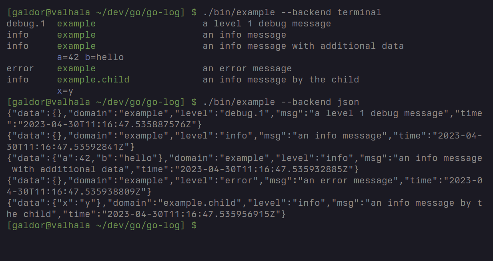

# go-log
## Introduction
The go-log library provides hierarchical loggers with a simple interface and
support for multiple backends.

## Usage
Go-log supports hierarchical logging: loggers are identified by a domain, a
multi-part string identifying the software component they are part of. This is
extremely useful when filtering large quantity of log messages in complex
software.

Loggers can create children. The domain of a child logger starts with the
domain of its parent; it also inherits its set of data.

Go-log currently supports the following backends:

- `terminal`: write human-readable log messages to the standard error output.
- `json`: write log messages encoded as JSON objects to the standard error
  output.

Refer to the [Go package
documentation](https://pkg.go.dev/github.com/galdor/go-log) for information
about the API, and see the [`example`](cmd/example/example.go) program.

The [go-service](https://github.com/galdor/go-service) library demonstrates
how to use go-log loggers for larger programs.

# Licensing
Go-log is open source software distributed under the
[ISC](https://opensource.org/licenses/ISC) license.
